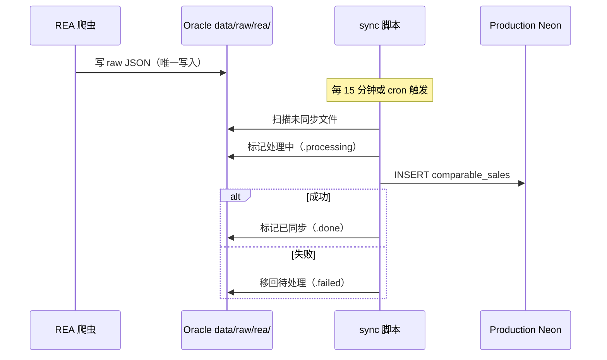

# REA Scraper 改造计划 — 从直写 Neon 到 Oracle 文件管线

## 原则
- 不中断现有数据采集（REA 数据一天都不能断）
- 一步一步迁移，每一步都可回滚
- 先试点再全量

---

## Phase 0 — 现状（不动）

```
REA 爬虫 → 直写 Production Neon (ep-winter-band)
```

- 每日 3AM 6 batch
- 周日 3AM 全量
- 已有 5,570 条 comparable_sales

**风险：** 无（运行中）

---

## Phase 1 — 双写（安全过渡）

**目标：** 在不中断生产的情况下，开始在 Oracle 上保留原始文件副本。

```
REA 爬虫 → 直写 Production Neon (照旧)
         ↘ 同时保存原始 JSON → Oracle data/raw/rea/
```

**具体改动：**

REA 爬虫每个 `INSERT` 之前，额外做一步：

```javascript
// 当前：立即写库
await sql`INSERT INTO comparable_sales (...) VALUES (...)`;

// Phase 1：先写文件，再写库
const rawRecord = { suburb, address, price, dateSold, ... };
fs.writeFileSync(
  `/opt/aushomevalue/data/raw/rea/${date}/${suburb}-${timestamp}.json`,
  JSON.stringify(rawRecord)
);
await sql`INSERT INTO comparable_sales (...) VALUES (...)`;
```

| 风险 | 概率 | 处理 |
|------|------|------|
| 写文件慢影响爬虫速度 | 低 | 文件写入 ~1ms，可忽略 |
| 磁盘满 | 低 | 每条 ~1KB，5k 条/天 = 5MB/天，45G 磁盘用不完 |
| 文件格式不一致 | 中 | 需要统一 JSON schema |
| 回滚难度 | 低 | 去掉写文件逻辑即可恢复 |

**可回滚：** ✅ — 去掉文件写入逻辑

**前置条件：**
- [ ] Oracle 上创建 `data/raw/rea/` 目录
- [ ] 统一 JSON schema 定义
- [ ] 爬虫增加 `writeRawFile()` 函数，不阻塞主流程

---

## Phase 2 — 文件优先（改爬虫逻辑）

**目标：** 爬虫只写文件，不再直写 Neon，由独立 sync 脚本负责 DB 写入。

```
REA 爬虫 → Oracle data/raw/rea/ (唯一写入点)
               ↘ sync 脚本（定时跑）→ Production Neon
```

**具体改动：**

1. 爬虫去掉所有 `INSERT INTO comparable_sales` 代码
2. 爬虫只做：抓取 → 格式化 → 写 JSON 文件到 `data/raw/rea/`
3. 新增独立 sync 脚本：读 `data/raw/rea/` 新文件 → 去重 → `INSERT` → 标记已同步



| 风险 | 概率 | 处理 |
|------|------|------|
| sync 脚本写库时爬虫还在写文件 → 读到不完整记录 | 中 | 文件先 `.tmp` 再 rename，sync 只读非 `.tmp` 文件 |
| sync 脚本挂了，文件积压 | 低 | 下次跑自动补上，监控积压文件数 |
| 数据重复 | 低 | sync 内置去重（按 REA ID 或地址+日期） |
| 生产数据延迟从实时变为 15 分钟 | 低 | valuation 不依赖最新销售数据，可接受 |

**可回滚：** ✅ — 改回直写模式，sync 脚本保留但停用

**前置条件：**
- [ ] Phase 1 运行一周以上，确认文件写入稳定
- [ ] sync 脚本写完并通过测试
- [ ] 数据一致性验证：sync 后 Production Neon 行数与 raw/ 文件数匹配

---

## Phase 3 — 加入校验层（加工管线完整）

**目标：** raw/ → processed/ → artifacts/ → review → sync 全链路打通。

```
REA 爬虫 → data/raw/rea/ → data/processed/rea/ → data/artifacts/rea/ → sync → Preview Neon
                                                                           ↘ review → Production
```

| 步骤 | 做什么 | 工具 |
|------|--------|------|
| raw/ | 爬虫原始 JSON | Node |
| processed/ | 清洗（去 null、类型校验、去重） | Python |
| artifacts/ | 按 suburb 聚合为 summary JSON | Python |
| sync（Preview） | 先写 Preview 验证 | Node + psql |
| review | 对比 Preview vs Production 数据 | 人工 |
| sync（Production） | 确认无误后推 Production | Node |

**改造代价：** 增加 processed/ 和 artifacts/ 步骤，但数据一致性更高。

---

## Phase 4 — 统一同步策略（REA + ABS + RBA + VicPlan 共用 sync）

**目标：** 所有数据源的 sync 共用 `config/sync.yaml`，一套脚本管所有管道。

```yaml
# config/sync.yaml
targets:
  preview:
    host: ep-damp-lab-a7oknmrc
    database: neondb
    user: neondb_owner
  production:
    host: ep-winter-band-a7qym6bq
    database: neondb
    user: neondb_owner

pipelines:
  rea:
    source: /opt/aushomevalue/data/artifacts/rea/
    target_table: comparable_sales
    mode: upsert
    schedule: every 30min
  abs:
    source: /opt/aushomevalue/data/artifacts/suburb_summary/
    target_table: suburb_snapshots
    mode: replace
    schedule: weekly
```

---

## 各阶段时间线预估

| Phase | 内容 | 工期 | 风险 |
|-------|------|------|------|
| **Phase 1** | 双写（加写文件） | 1-2 天 | 低 |
| **Phase 2** | 文件优先 + sync 脚本 | 3-5 天 | 中 |
| **Phase 3** | 加工管线完整 | 3-5 天 | 中 |
| **Phase 4** | 统一 sync | 2-3 天 | 低 |

**当前建议：** 先跑通离线 ETL 试点（ABS/RBA/VicPlan），再回头做 REA Phase 1。不并行，避免事故。
