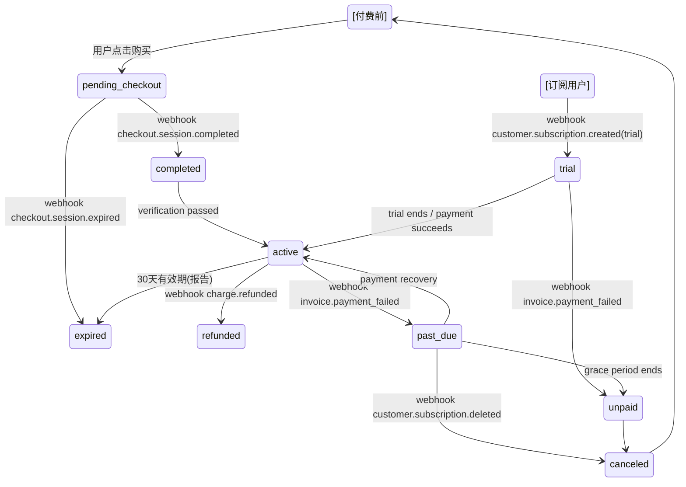

# Stripe Phase 0A — 收费前现状审计

**日期**: 2026-06-12
**基准 commit**: `278484c` (Phase 1B: restore migration-009, add X-Session-Id from sessionStorage)
**目标**: 记录当前收费相关功能的完整状态，识别安全缺失和待办事项

---

## 1. 当前估值报告流程

### 免费估值概要 — 已上线

`api/valuation.js` POST 端点：
- 输入：地址 + suburb + state + propertyType
- 输出：估值概览（midpoint/range/keyFeatures/confidence）+ **lockedPreview**

`buildLockedPreview()` 函数在 `api/valuation.js:135` 构建 lockedPreview 结构：
- 6 章固定章节：Comparative Sales Analysis、Micro-Location Assessment、Planning & Zoning Review、Suburb Profile & Trends、Confidence Assessment、Investment Suitability
- 每章含动态 teaser（基于当前估值数据生成的实际数据描述，如 comparables 数量、confidence label）
- 固定价格：`AUD $3.99` / `Introductory Offer` / `Coming Soon — Full Valuation Report`
- 结算条款：`One-time payment. PDF download included.`

### 前端 lockedPreview 渲染

`public/app.js` `renderLockedPreviewHTML()` (~line 1827)：
- 在估值结果下方绘制虚线框，显示 6 章节列表 + 价格 + CTA 按钮
- CTA 按钮行为：`window.scrollTo({top: document.querySelector('.lead-panel')?.offsetTop})` — 仅滚动到注册表单，**不触发任何服务器请求**
- Existing user 链接：`<a id="existing-unlock-link">Full report -- Coming Soon...</a>` — 纯文本无后端验证
- 已有 PDF 下载试用版 `downloadDemoReport()` 但无付费检查

### api/valuation-full.js — Hardcoded Coming Soon

整个端点（POST `/api/valuation-full`）返回硬编码 `coming_soon`，**完全不读取 token、不检查权限、不返回任何报告内容**。

```json
{
  "ok": false,
  "status": "coming_soon",
  "message": "Full valuation reports are coming soon. Introductory price AUD $3.99 one-time.",
  "price": "AUD $3.99",
  "lockedPreview": { "chapters": [...], "terms": "One-time payment. PDF download included." }
}
```

代码中有清晰的注释标记：
```
// Phase 1B: Always return coming_soon regardless of token.
// Full report will be served in Phase 2+ after Stripe integration.
```

## 2. 当前 Opportunity 流程

### 免费 Top 10 — 已上线

机会页面触发流程：

1. 用户点击"View Opportunities" → `opportunity-gate.js:showGate()` 弹出注册覆层
2. 已注册用户：`GET /api/unlock-opportunity` 自动携带 `aushomevalue_opportunity_gate` HttpOnly cookie
   - 服务端验证 HMAC token（24h 有效期）
   - 有效 → 返回 `{ok: true, status: "active", email, top10: [...]}`
   - 无效 / 无 cookie → 返回 `{ok: true, status: "none"}`
3. 未注册用户：填写表单 → `POST /api/unlock-opportunity` 带 `X-Session-Id` header
   - 服务端存储 lead 数据，创建 `opportunity` 级别 HMAC token
   - 设置 HttpOnly Secure SameSite=Lax cookie
   - 返回 Top 10 排名（基于 Opportunity Engine V2 的 6 维评分）

### 订阅入口 — UI 已存在但无功能

`opportunity-gate.js` 注册覆层底部含订阅定价区块：
- 标题：`🏗 Full Opportunity Intelligence`
- 价格：`Start Your 7-Day Free Trial | Then AUD $9.99/month`
- 文案：试用取消条款、自动续费说明、Marketing consent 独立声明
- **状态：** `Coming Soon — payment integration pending`

**无实际支付代码、无 Stripe 引用、无订阅后端端点。**

## 3. 可以复用的代码和数据表

### 后端基础设施

| 组件 | 文件 | 复用方式 |
|------|------|----------|
| Neoni SQL client | `api/_db.js` | 已有连接池，支付表直接加入 |
| HMAC signed token | `lib/signed-token.js` | `createToken()`/`verifyToken()` 可用于 payment entitlement token |
| HttpOnly cookie | `lib/signed-token.js` | `setTokenCookie()`/`getTokenFromCookies()` 可直接复用或扩展 |
| Cookie parser | `lib/signed-token.js` | 手动解析（无外部依赖），可扩展支付 cookie |
| 匿名 session ID | `lib/signed-token.js` | `generateSessionId()` crypto-random 16 bytes hex |
| Vercel 60s timeout | `vercel.json` | 已配置 `maxDuration: 60`，足够 Stripe webhook |

### 数据库表（可直接扩展的已有表）

| 表名 | 现有功能 | 支付扩展 |
|------|----------|----------|
| `lead_contacts` | 邮箱唯一、email_lower 索引 | 可关联 `stripe_customers.customer_id` |
| `lead_preferences` | 投资偏好（budget, state, goal, property_type） | 可扩展 subscription_id |
| `lead_events` | 事件追踪（event_type + JSONB） | 可记录 payment/session/subscription 事件 |
| `consent_records` | 类型化 consent audit trail | 可直接记录 payment consent |
| `lead_session_contacts` | session → contact 绑定 | 可扩展 session → payment 绑定 |

### 前端可复用组件

| 组件 | 位置 | 备注 |
|------|------|------|
| `getFunnelSessionId()` | `opportunity-gate.js` | sessionStorage 持久化，可复用为 checkout session tracking |
| `renderLockedPreviewHTML()` | `app.js` | 已有章节 + 价格渲染，CTA 需要改为 Stripe checkout 链接 |
| i18n 框架 | `app.js` | 中英文切换已就绪 |
| Coming Soon 占位 | 多处 | 全部按钮/Cookie/文案均处于 Coming Soon 状态，未对外承诺 |

## 4. 缺失的支付模块

| 模块 | 当前状态 | 需要什么 |
|------|----------|----------|
| Stripe SDK | 完全不存在 `package.json` 中无 `stripe` 依赖 | `npm install stripe` |
| STRIPE_SECRET_KEY | 无环境变量 | Vercel env + local .env |
| STRIPE_WEBHOOK_SECRET | 无 | Vercel env + webhook endpoint |
| Stripe Products/Prices | 未创建 | 2 个 product：AUD $3.99 one-time + AUD $9.99/month subscription |
| Checkout Session API | 不存在 | `/api/create-checkout-session` POST |
| Customer Portal API | 不存在 | `/api/create-customer-portal-session` POST |
| Webhook endpoint | 不存在 | `/api/stripe-webhook` POST（原始 body + signature 验证） |
| Payment DB tables | 不存在 | `stripe_customers`, `payments`, `subscriptions`, `entitlements`, `stripe_webhook_events` |
| Report entitlement check | 不存在 | 需要 `api/check-report-entitlement` 或 middleware |
| PDF deliver after payment | 不存在 | 需要在 webhook handler 中生成签名的报告访问 token |
| Success/cancel/failure pages | 不存在 | Stripe Checkout return URLs 的目标页面 |
| Cancel subscription UI | 不存在 | Customer Portal 或 inline 取消界面 |
| Past_due / unpaid handling | 不存在 | Webhook + email notification |

## 5. 当前付费绕过风险

### 已修复或受控的风险

| 风险 | 现况 | 评估 |
|------|------|------|
| `GET /api/valuation-full` 未授权 | 硬编码返回来 `coming_soon`，不读 token | ✅ **当前安全** |
| `POST /api/valuation-full` 未授权 | 同上 | ✅ **当前安全** |
| PDF 无付费保护 | `downloadDemoReport()` 仅生成 demo PDF，不含真实估值数据 | ✅ **当前安全** |
| Opportunities cookie 可被前端消费 | HttpOnly cookie 后端验证，前端不可读 | ✅ **当前安全** |
| JWT/token 在前端 localStorage | HMAC token 在 HttpOnly cookie，不在 localStorage | ✅ **当前安全** |
| Signed token 无需数据库验证 | HMAC 本身已是无状态验证，24h TTL | ✅ **可接受** |
| 重复 409 冲突保护 | `unlock-opportunity.js` 已实现 session 冲突检测 | ✅ **已实现** |

### 需要关注的潜在风险（当前未暴露但 Stripe 接入时必须防范）

| 风险 | 说明 | 严重度 |
|------|------|--------|
| **客户端控制金额** | 前端 POST `price: "1.00"` 需服务端 price ID 白名单 | 🔴 **高** |
| **客户端控制产品** | 前端选择 product/price 时必须服务端校验 | 🔴 **高** |
| **缺乏幂等键** | 无 `idempotency_key` 可能重复收费 | 🟡 **中** |
| **success_url 信任** | 只依赖 success URL 展示付费报告（不验证付款状态） | 🔴 **高** |
| **Webhook 验证缺失** | 不验证 webhook 签名可伪造付款通知 | 🔴 **高** |
| **entitlement 未认证** | 付款后报告 URL 被分享泄露 | 🟡 **中** |
| **Opportunity token 滥用** | 当前 `gate_level` 只有 `"opportunity"`，扩展时未限制 | 🟡 **中**（已知问题） |
| **缺乏退款撤销** | 退款后 entitlement 继续有效 | 🟡 **中** |
| **GST 未预留** | 当前 `AUD $3.99` 显示不区分 GST | 🟢 **低**（产品期暂可接受） |
| **测试环境混合** | 无 `NODE_ENV` 判断 Stripe test/prod key | 🟡 **中** |

## 6. Stripe 接入前必须处理的问题

### P0 — 必须接入前解决

1. **安装 `stripe` npm 依赖** — 第零步
2. **增加 `TOKEN_SIGNING_SECRET` 密钥** — 当前 `signed-token.js` 生产环境下如果没有 `TOKEN_SIGNING_SECRET` 会 throw。需要确认 Vercel 已有。
3. **创建 Stripe 产品/价格** — 在 Stripe Dashboard 中创建两个 product 并记录 price IDs
4. **决策：entitlement 绑定方式** — 绑定到 email（兼容现有 lead 体系）还是 Stripe customer ID
5. **权限 gate_level 扩展** — 当前 `signed-token.js` 只有 `opportunity` 级别，需要 `report` 级别或独立的 report entitlement token

### P1 — 接入前最好处理

6. **Payment 相关 DB 表 schema 设计** — 见 Phase 0B 设计
7. **Vercel 环境变量规划** — 哪些在 .env、哪些在 Vercel Dashboard
8. **Webhook 端点路径选择** — `/api/stripe-webhook` 需要排除 `maxDuration` 60s 限制外的额外配置
9. **Success/cancel 页面 URL 设计** — 当前 SPA 无路由，需要 query param 或路径方案

## 7. 下一阶段 Phase 0B 应该设计什么

Phase 0B 的设计输出应为 `docs/engineering-reports/STRIPE_PHASE0B_DESIGN.md`，包含：

### 数据库 Schema

5 张新表的设计：
- `stripe_customers` — lead_contact_id ↔ Stripe customer_id 映射
- `payments` — 单次支付的记录（amount、currency、status、checkout_session_id）
- `subscriptions` — 订阅记录（stripe_subscription_id、status、current_period_start/end）
- `entitlements` — 权限（type=report|opportunity、property_key (optional)、expires_at、grant_reason）
- `stripe_webhook_events` — 幂等日志（stripe_event_id UNIQUE、type、status、received_at）

### API 清单

| 端点 | 方法 | 用途 |
|------|------|------|
| `/api/create-checkout-session` | POST | 创建 Stripe Checkout Session（单次报告） |
| `/api/create-subscription-session` | POST | 创建订阅 Checkout Session（机会订阅） |
| `/api/create-customer-portal-session` | POST | 创建 Stripe Customer Portal 链接 |
| `/api/stripe-webhook` | POST | Stripe webhook 接收（原始 body） |
| `/api/check-report-entitlement` | POST | 检查指定 property 是否已付费解锁 |
| `/api/check-subscription-status` | GET | 检查当前用户订阅状态 |
| `/api/valuation-full` | POST | **改造**：检查 entitlement 后返回完整报告 |

### 权限状态机



### 安全规则

1. 服务端只接受 price ID 白名单（非金额）
2. Webhook 用原始 body + signature 验证
3. 报告权限绑定：`(email/customer_id, property_report_id)` 二元组
4. 订阅权限绑定：`(email/customer_id, "opportunity")`
5. 不记录卡号、完整邮箱到日志
6. Stripe keys 只进 Vercel env，不进代码库

### 页面/文案

- 成功页面：现有 SPA + query param `?checkout=success&session_id=xxx`
- 取消页面：`?checkout=cancel`
- 失败/错误页面：`?checkout=error`
- GST 显示预留：`AUD $3.99 (incl. GST)`
- 自动续费声明：已有文案在 `opportunity-gate.js`，需确认与合法要求一致

### 人工确认项

1. **GST 处理方式**：$3.99 含 GST 还是 +GST
2. **退款政策**：数字产品一般无退款的 Atty 确认
3. **《Australian Consumer Law》合规**：自动续费条款、取消权益
4. **免责声明文案**：估值报告"研究用途，非专业估值"等律师审核
5. **退款/撤销后的访问策略**：refund → 立即撤销权限 / 保留只读？

---

## 审计结论

**当前系统在 Phase 1B 完成后处于完全"Coming Soon"的安全状态**——无支付代码、无 Stripe 集成、无预埋的付费绕过路径。所有付费入口（full report、订阅）都返回硬编码的 Coming Soon 响应，不受任何 token 或 cookie 影响。

**审计评级：🔒 安全 — 无需紧急修复。建议有序进入 Phase 0B 设计阶段。**

主要关注点：
- 唯一必须提前确认的是 `TOKEN_SIGNING_SECRET` 在 Vercel 上的配置状态
- Stripe 依赖安装本身无安全风险
- 数据库 schema 设计可以在 Phase 0B 一次性完成

---

*由玄甲生成 — 仅供 Codex 复核，勿用于代码实施*
