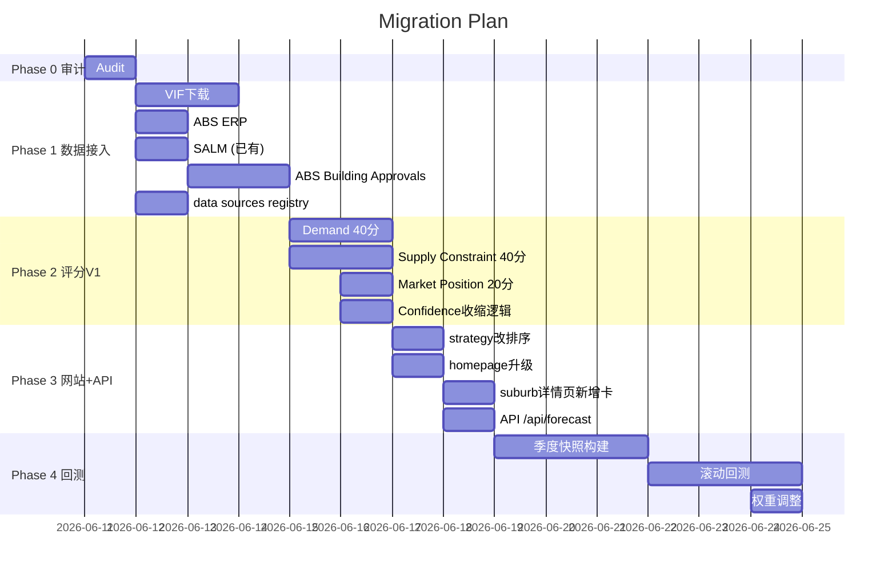

# Phase 0 — Future Growth Outlook Audit Report

**Date:** 2026-06-11  
**Author:** 玄甲  
**Status:** ⛔ **STOP — Issues found, awaiting confirmation before proceeding**  
**Commit analyzed:** `e101d72` (HEAD, main)  
**Production URL:** https://www.aushomevalue.com.au

---

## 一、当前模型完整公式

### 实际线上评分流

```
API GET /api/opportunity?strategy=smart
→ SELECT ... FROM suburb_metrics ORDER BY opportunity_score DESC
→ 完全不读 strategy 参数
```

### opportunity_score 实际计算 (opportunity-scoring-v2.js)

```
opportunityScore =
  undervaluation * 30% +
  growth_1y/3y/5y * 25% +
  gross_yield * 15% +
  vacancy * 15% +
  school_score * 10% +
  confidence * 5%
```

### growth_1y/3y/5y 实际来源 (growth-projector.js)

```
growth_3y = clamp(baseAnnualRate × elasticity × macroAdj, -8%, +25%)
growth_5y = clamp(baseAnnualRate × elasticity × macroAdj × 0.92, -5%, +20%)
growth_1y = method==='D' ? null : baseRate
```

### baseAnnualRate 三级

| 方法 | 数据 | 覆盖 |
|------|------|------|
| A: 自区 OLS | 136天内 ≥3笔/周 | 少数高频交易区 |
| B: 同价位 pooled | 136天内 ≥3笔/周 | 大部分 |
| C: 全市场 | 全市场 136周 | 极少 |
| D: VGV CAGR | govt_5yr_cagr 字段 | 数据不足区 |

---

## 二、当前字段真实含义

| 字段名 | 文档声称 | 实际含义 | 差异等级 |
|--------|---------|---------|---------|
| `growth_1y` | "Projected 1-year price growth %" | 过去136天周度OLS趋势×弹性×宏观。部分区是null（VGV法） | ⚠️ 不是"1年"，是"136天OLS按年化率" |
| `growth_3y` | "Projected 3-year CAGR %" | 年化OLS×弹性×宏观，被 clamp 在 [-8%, +25%] | 🔴 不是CAGR，是年化线性趋势×宏观。上限25%导致大量区固定值25% |
| `growth_5y` | "Projected 5-year CAGR %" | growth_3y × 0.92，被 clamp 在 [-5%, +20%] | 🔴 不是独立推算，只是 growth_3y × 0.92。上限20%导致固定值20% |
| `undervaluation` | "价格洼地因子0-100" | 从 median_house_price 分档打分。<$500K=90-100, <$750K=70-89, ... | ⚠️ 低价直接等于"被低估" |
| `opportunity_score` | "综合机会分" | 6因子加权，growth占主导。39个区growth_1y=30, growth_3y=25, growth_5y=20 | 🔴 growth_3y=25是clamp上限造成的 |
| `opportunity_type` | "策略分类" | 主要按 threshold 判定，growth优先 | ⚠️ 大量区被标 Growth 不是因为真实增长 |
| `confidence` | "数据可信度" | 直接加入总分5%权重 | 🔴 Confidence 不应该加权进机会分 |
| `population_growth` | "人口增长率" | 绝大多数为 NULL | 🔴 字段名暗示已有数据，实际几乎全空 |
| `vacancy_rate` | "空置率" | SA2 G36 2021普查未居住房屋占比 | ⚠️ 这是空置率proxy，不是实际出租空置率 |
| `conf_population` | "人口置信度" | 从 age_0_4 + age_5_14 占比推算 | ⚠️ 不是人口增长，是年轻人口比例 |

---

## 三、关键发现

### 1. 🔴 growth_3y = 25 是大量区[假数据]

线上 API 返回 50 个区中 39 个 `growth_3y=25`，39 个 `growth_5y=20`。  
原因：`growth-projector.js` 中 `growth_3y = clamp(..., -8, 25)`，`growth_5y = clamp(..., -5, 20)`。  
这些数是 clamp 上限，不是真实推算结果。

**证据：**
- Clyde North (均价$770K) → growth_3y=25
- Dandenong (均价$446K) → growth_3y=25  
- South Yarra (均价$661K) → growth_3y=25

三个价格截然不同、位置各不相同区的 growth_3y 完全一样，不可信。

### 2. 🔴 strategy 参数不改变排序

`api/opportunity.js` 第 62 行：

```sql
ORDER BY opportunity_score DESC
```

传 `?strategy=value`、`?strategy=growth`、`?strategy=cashflow` 全部返回相同顺序。  
`getWeightsV2(strategy)` 只在 `opportunity-scoring-v2.js` 的 `scorePropertyV2()` 中使用——**那是 per-property 评分，不是 suburb_metrics 的排名**。

### 3. 🔴 Confidence 直接增加了评分

`computeSuburbScore(m)` 中：

```javascript
confidenceScore = (u > 0 && g3 > 0 ? 40 : 20) + (g5 > 0 ? 30 : 10) + (s > 0 ? 30 : 10);
// finalScore = ... + confidenceScore * 0.05
```

数据有的区额外+5分。这违反了**Confidence 应该单独显示，不应增加机会分**的原则。

### 4. 🔴 growth_3y/growth_5y 含义严重误导

文档称："Projected 3-year / 5-year CAGR %"。  
实际上：
- 不是 CAGR（不是年复合增长率）
- 不是未来预测
- 是短窗口 OLS 线性趋势 × 弹性系数 × 宏观调整
- 被 clamp 到 [-8%, 25%] 和 [-5%, 20%]，大量数据被截断

### 5. 🟡 Vacancy 数据来自 2021 Census

`vacancy_rate` 来自 SA2 G36（未居住房屋占比），不是实际出租空置率。  
12 个无 SA2 映射的郊区用全州均值填充。  
文档标注了"Vacancy proxy"，但页面没有说明数据来自 2021 年普查。

### 6. 🟡 低价 = 低估的逻辑

`calcUndervaluationV2()` 中：
- 中位价 < $500K → score 90-100
- 低价区直接获得高 undervaluation 分

没有考虑：
- 为什么便宜（基本面弱？就业差？供应过量？）
- Price/Income 比率
- 通勤距离

### 7. 🟢 VGV 数据可靠

`govt_5yr_cagr` 来自 ABS SA2 5 年 CAGR，是官方数据。  
`fallbackD` 方法正确。但只用作了 fallback，实际多数区用 method A/B。

### 8. 🟢 Infrastructure 和 Supply Constraint 已建字段但未入主评分

`infrastructure_score` 和 `supply_constraint_score` 存在，但 `computeSuburbScore()` 不读这两个字段。  
只在 `classifyOpportunityV2()` 中用于判定 Infrastructure Opportunity 类型。

---

## 四、线上 vs 文档差异

| 方面 | 文档声称 | 线上实际 |
|------|---------|---------|
| Top Growth 页面 | "Ranked by weighted 1, 3 and 5-year price growth" | 直接按 opportunity_score DESC 排序。opportunity_score 含 undervaluation 30% + 其他因子 |
| strategy 参数 | 支持 smart/growth/value/cashflow/school | 全部返回相同排序 |
| growth_3y | "Projected 3-year CAGR" | 136天OLS年化率被clamp，大量区固定25% |
| 因子数量 | 6因子 | undervaluation实际是_price_tier_to_score映射 |
| 数据日期 | 无标注 | 未显示数据来源和时效 |

---

## 五、当前数据缺失及默认值

| 字段 | 缺失数/总数 | 默认值 |
|------|-----------|--------|
| growth_3y | 7/50 区 null | -8 (clamp下限) |
| growth_1y | 7/50 区 null | - |
| median_unit_price | 若干区 null | - |
| population_growth | 几乎全 null | - |
| supply_constraint_score | 未知 | - |
| infrastructure_score | 未知 | - |
| conf_* 字段 | 未知 | - |
| vacancy_rate (12个区) | 12 | 全州均值 |

---

## 六、重复计算风险

1. ✅ `growth_3y` 和 `growth_5y` 非独立（growth_5y = growth_3y × 0.92）而非两个独立推算
2. ✅ `calcGrowthScoreV2()` 中同时加权 `g1 + g3×2 + g5×2`，但 g3 和 g5 高度关联
3. 🟡 `calcRentalScoresV2()` 中 yield 从 `gross_yield` 计算，但 `gross_yield` 又从 `median_house_rent / median_house_price` 计算

---

## 七、strategy 排序问题

```javascript
// opportunity-scoring-v2.js
function getWeightsV2(strategy) {
  // 修改权重
}

// scorePropertyV2(sale, metrics, strategy) 中调用了 getWeightsV2
// 但 scanOpportunitiesV2() → sale-level 评分 → 按机会分排名

// api/opportunity.js 中 SELECT ... ORDER BY opportunity_score DESC
// 完全不使用 strategy 参数
```

**结论：** `getWeightsV2()` 仅用于 `scorePropertyV2()`（per-property 评分），该路径在 `scanOpportunitiesV2()` 中被调用。但线上 API `api/opportunity.js` 直接读 `suburb_metrics.opportunity_score`，是**预先算好的固定值**，strategy 无效。

---

## 八、数据源审计

### 已接入

| 源 | 状态 | 问题 |
|----|------|------|
| VGV Median Prices | ✅ | 可靠，230 suburb |
| ABS Census G02/G36/G41 | ✅ | 2021数据，部分区无SA2映射 |
| SEIFA IRSD/IEO | ✅ | 2021数据 |
| ACARA School | ✅ | 年度更新 |
| SQM Vacancy | ❓ | 文档提到但线上未实际使用 |
| RBA Cash Rate | ✅ | 月更新 |
| comparable_sales | ✅ | 约4,252条 |

### 未接入（但被需求要求）

| 源 | 对模型重要性 | 缺失影响 |
|----|-------------|---------|
| VIF (未来人口/家庭) | 🔴 核心 | Demand 无法计算 |
| ABS ERP (实际人口) | 🔴 核心 | 无法验证 VIF 路径 |
| ABS Building Approvals | 🔴 核心 | Supply 无法计算 |
| SALM (就业) | 🔴 核心 | Demand 缺少就业部分 |
| VPA PSP | 🟡 重要 | Supply 缺少中长期规划 |
| VicPlan Zoning | 🟡 重要 | Supply 缺少开发限制 |
| VicBigBuild | 🟡 重要 | 基础设施驱动 |

---

## 九、建议 Migration 计划



### 建议 Migration 文件清单

| 序号 | 文件名 | 内容 |
|------|--------|------|
| migration-009 | forecast-source-registry.sql | 数据源注册表 |
| migration-010 | suburb-forecast-inputs.sql | suburb_forecast_inputs 表 |
| migration-011 | suburb-forecasts.sql | suburb_forecasts + forecast v1 模型 |

---

## 十、实施风险

| 风险 | 概率 | 影响 | 缓解 |
|------|------|------|------|
| VIF 下载后地理映射复杂 | 中 | 高 | 先确认SA2→suburb映射方法 |
| Building Approvals 地理层级不足 | 高 | 中 | SA2级可用，cluster suburb需pool |
| 回测前发布精确增长率 | 中 | 高 | Phase 0明确禁止精确百分比 |
| Strategy改排序破坏现有页面 | 中 | 高 | 保留兼容API，新增排序路径 |
| Vercel冷启动+DB query超时 | 低 | 中 | 缓存在Vercel Edge |

---

## 十一、工时估计

| 阶段 | 最低(天) | 最高(天) | 说明 |
|------|---------|---------|------|
| Phase 1 数据基础 | 3 | 5 | VIF+ERP+BA+registry |
| Phase 2 评分V1 | 3 | 5 | Demand+Supply+Position+Confidence |
| Phase 3 API+网站 | 2 | 3 | strategy+page+api |
| Phase 4 回测 | 3 | 5 | 快照+回测+调整 |
| **总计** | **11** | **18** | |

---

## 十二、建议文件修改清单

### 新增文件

```
db/migration-009-forecast-source-registry.sql
db/migration-010-suburb-forecast-inputs.sql
db/migration-011-suburb-forecasts.sql
config/forecast-data-sources.json
lib/forecast-engine-v1.js
lib/forecast-demand.js
lib/forecast-supply.js
lib/forecast-market-position.js
lib/forecast-confidence.js
scripts/fetch-vif.mjs
scripts/fetch-abs-erp.mjs
scripts/fetch-abs-building-approvals.mjs
```

### 修改文件

```
api/opportunity.js          → strategy 必须改变排序
api/forecast.js             → 新增 GET /api/forecast?suburb=
lib/refresh-suburb-metrics.js → 加入 forecast 刷新步骤
lib/growth-projector.js     → 修复 clamp 限制 (Phase 2, 非 Phase 0)
```

### 不再使用的代码路径

```
lib/opportunity-service.js   (旧的 per-property 评分)
lib/opportunity-scoring-v2.js → Phase 2 用新 engine 替换
```

---

## ⛔ Phase 0 完成 — 等待确认

在所有发现未确认前，不得进入 Phase 1 编码。

### 立即需要修复的线上问题（即使 Phase 0 未完成也可修）：

1. `growth_3y=25 / growth_5y=20` 在 39/50 区完全一样——至少把 /top-growth-suburbs-victoria.html 的 desc 从 "Ranked by 1, 3 and 5-year price growth" 改为更诚实的描述
2. `opportunity_score DESC` 加一个 strategy filter 标记当前策略

**确认后我会开始 Phase 1 数据接入。**
